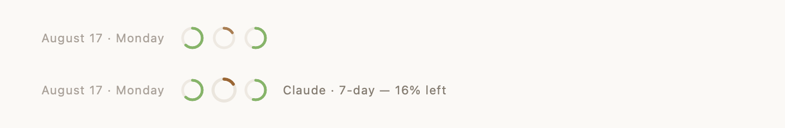

# Your Turn

**An inbox for your Claude Code and Codex sessions — and a record of where your
tokens went.**

Three, five, eight agent sessions running at once — some Claude Code, some Codex — and
we're the bottleneck. Your Turn sits in the macOS menu bar so we can see at a glance:
**which sessions are still open? which one is waiting for my reply? how much allowance
is left this week? and which projects have been eating my tokens?**

Your Turn runs no LLM, reads no conversation, and collects nothing. It reads your
session information locally, out of `~/.claude` and `~/.codex`.

English | [繁體中文](README.zh-TW.md)


## Whose turn is it?

Every step means waiting, so we tab away to another project — and some of those
sessions we simply forget about, while the agent sits there waiting for the next
instruction. Your Turn puts all of them on one screen, so you can see which one is
waiting for your reply.

Each session gets three lines: the title, the last thing you said, the last thing the
agent said. You know where it stopped without opening it.

Click one and it takes you back to where that session lives — iTerm2 and Terminal
switch to the right tab; VS Code, Cursor, Windsurf and Zed to the right window.
Sessions that have finished reopen in a new terminal with `claude --resume` or
`codex resume`.

## What have you been busy with?


The Usage tab answers the thing you can't reconstruct from memory: **which projects
took your week, and which one burned the most tokens.** Pick a month or a week and the
whole page re-scopes to it.

Claude Code records token counts but no cost, so the dollars are worked out against
[LiteLLM's public price table](https://github.com/BerriAI/litellm/blob/main/model_prices_and_context_window.json).

Codex spend isn't supported yet — on that side there's only the allowance.

### A contribution graph, for tokens


One square per day, shaded by how hard that day went. Click a square, or step with the
arrows, to scope the page to that month or week.

## Two agents, one inbox

Claude Code and Codex each keep their records in their own place, in their own format.
Your Turn reads both into one list, so you stop checking two places.

Past that they behave the same: a Codex row stars, archives and jumps back exactly like
a Claude one. The agent name only shows up on the rows when you're actually running
both.

## How much is left?



Three rings sit in the window's header: Claude Code's 5-hour and weekly windows, and
Codex's weekly one. Hover for the reading; the Usage tab has the same three as labelled
bars.

They say what's **left**, not what you've used — what you actually want to know is
whether there's room for the thing you're about to start. Below 20% they turn amber.

Codex already writes its allowance into its records. Claude Code only puts it on the
status line, so the two Claude rings stay empty until you switch on **Settings → Claude
allowance**. That adds one `statusLine` line to `~/.claude/settings.json`; any status
line you already have gets chained behind it rather than replaced. It's the only thing
this app writes, and switching it off puts the file back.

## Features

- **Both agents in one inbox** — Claude Code and Codex, one list
- **Menu bar badge that only counts what needs you** — running sessions don't ring
- **Click to jump back to where the session lives** — iTerm2, Terminal, VS Code,
  Cursor, Windsurf, Zed
- **How much allowance is left** — three rings in the header, labelled bars on the
  Usage tab
- **Star** the projects you care about, **archive** what you don't
- **Usage tab** — which projects took the week, with a heatmap and month / week filters
  (dollars for Claude Code only)
- **Start at login** — one switch in Settings
- **Three hand-tuned palettes** (light / dim / dark)
- **English and 繁體中文** — follows your system language, or pick one in Settings
- **Zero dependencies** — pure Swift 6 / SwiftUI, no third-party packages

## Privacy

Your Turn is a **reader**. Claude Code and Codex already write everything it needs into
`~/.claude` and `~/.codex`; this app just reads it.

- **Read-only, with one exception you switch on yourself** — the allowance switch adds
  a single `statusLine` key to `~/.claude/settings.json` and restores the file when you
  switch it off. Nothing else in the app writes to either directory
- The inbox reads only the tail of each session file; the Usage tab reads whole files
  but only counts token numbers — it still never looks at what you or the agent said
- **No telemetry, no LLM calls** — nothing about you ever leaves your Mac
- **Two outbound requests only:** LiteLLM's price table, so new models don't show up
  unpriced, and GitHub's releases API once a day, to notice when there's a newer
  version. Both are plain GETs to public URLs and send nothing
- Preferences (stars, archive, appearance) stay on your machine
- Open source — audit it yourself

The only permission it asks for is Apple Events (to switch your terminal back to a
session's window), and macOS prompts you before granting it.

## Install

**Requirements:** macOS 15+, and [Claude Code](https://claude.com/claude-code) and/or
[Codex](https://github.com/openai/codex) — either one on its own is enough.

- **Homebrew:**

  ```bash
  brew install --cask himynameisben/tap/your-turn
  ```

  `brew upgrade --cask your-turn` follows new releases. The cask lives in
  [himynameisben/homebrew-tap](https://github.com/himynameisben/homebrew-tap).

- **Download** the signed & notarized app from [Releases](../../releases), unzip,
  and drag it to Applications.
- **Build from source:**

  ```bash
  git clone https://github.com/himynameisben/your-turn.git && cd your-turn
  ./Scripts/install.sh
  ```

  That builds it, puts it in `/Applications` and launches it; re-run the same line to
  upgrade. To keep it in `build/` instead, use `./Scripts/bundle.sh release` — but
  "start at login" registers whatever bundle path it was switched on from, so the copy
  you actually live with belongs in `/Applications`.

## How it works

Everything comes from files the two agents already maintain: Claude Code's
`~/.claude/projects` (session contents and token counts) and `~/.claude/sessions` (which
process is running which session); Codex's `~/.codex/state_*.sqlite` (its thread index),
`sessions/` (the transcripts) and `thread-writer-locks/` (which thread is running).

Why only the tail of a file gets read, why mtime can't be trusted, and how live
processes are matched to sessions are all documented with measured numbers in
[CLAUDE.md](CLAUDE.md) and the source comments.

Screenshots on this page are rendered from invented data with
`YourTurn --render <dir> --demo`, never from a real scan.

## Contributing

See [CONTRIBUTING.md](CONTRIBUTING.md). The short version: keep it a reader, keep
it dependency-free, and verify changes with the built-in `--dump` / `--cost` /
`--render` tools.

## License

[MIT](LICENSE)
