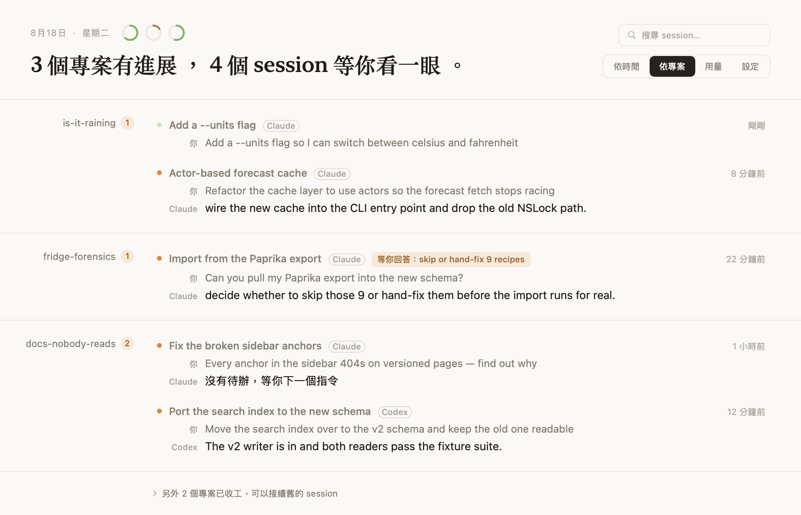
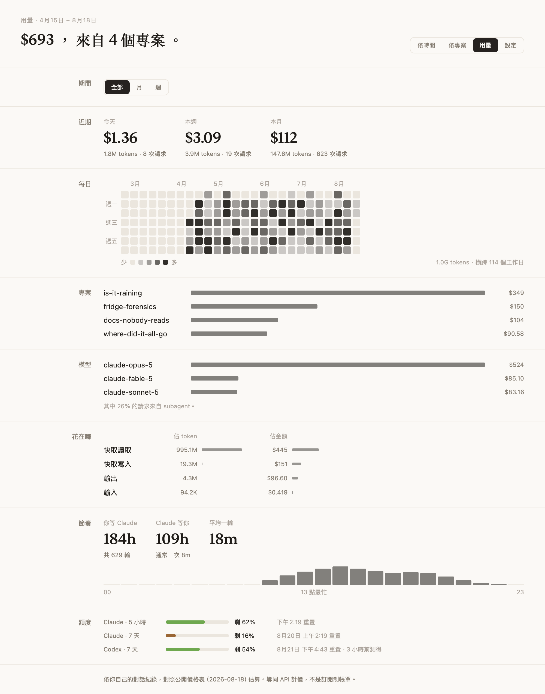
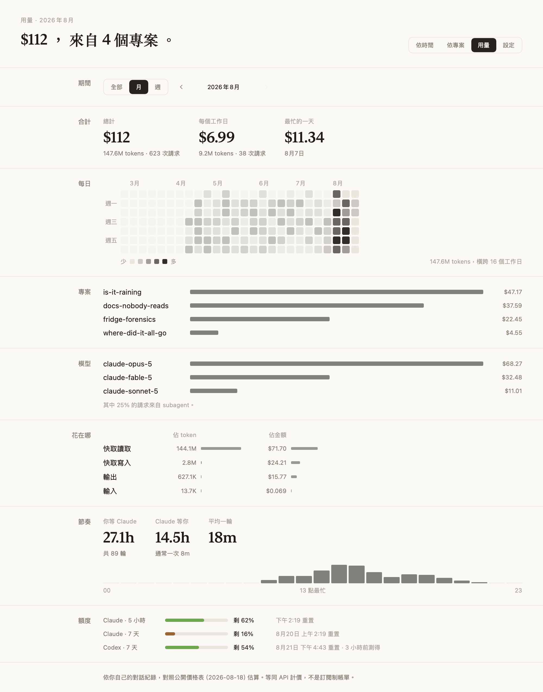
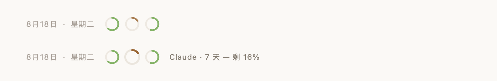

# Your Turn

**Claude Code 和 Codex 的收件匣，順便幫你記得 token 都燒到哪去了。**

當你同時開三個、五個、八個 agent session——有些是 Claude Code、有些是 Codex——瓶頸就
變成我們自己。Your Turn 常駐在 macOS menu bar，讓我們可以快速看到：**哪些 session 還
開著？哪個在等我回覆？本週額度還剩多少？我的 token 都燒在哪些專案上？**

Your Turn 不跑 LLM、不讀對話內容、沒有任何數據收集，透過本地的程式讀取 `~/.claude`
和 `~/.codex` 取得 session 資訊。

[English](README.md) | 繁體中文



## 現在輪到誰？

AI 每個步驟都要等，我們常常都會忍不住在多個專案跳轉，有些 session 對話送出之後就忘記
了，AI Agent 苦苦的等著我們下一步指示。透過 Your Turn 就可以讓你有一個統一的畫面可以
去查看各個 session 的對話，知道哪一個在等你的回覆。

每個 session 三行：標題、你最後說的話、agent 最後說的話。不用點進去就知道它停在哪、
接下來要做什麼。

點一下就跳回那個 session 原本的工作環境——iTerm2 和 Terminal 會切到正確的分頁，
VS Code、Cursor、Windsurf、Zed 會切到正確的視窗。已經結束的 session 則在新的終端機用
`claude --resume` 或 `codex resume` 接續。

## 這陣子到底在忙什麼？



用量分頁回答的是自己回想不起來的事：**這週的時間被哪些專案吃掉、哪一個燒掉最多
token。** 選一個月或一週，整頁就跟著縮到那段期間。

Claude Code 只把 token 數寫進紀錄、不寫金額，所以金額是對照
[LiteLLM 的公開價格表](https://github.com/BerriAI/litellm/blob/main/model_prices_and_context_window.json)
算出來的。

Codex 的費用暫時還不支援，那邊只看額度。

### token 版的貢獻熱度圖



一格一天，深淺代表那天用得多兇。點任一格、或用箭頭前後翻，整頁就縮到那個月或那一週。

## 兩個 agent，一個收件匣

Claude Code 和 Codex 各自把紀錄存在自己的地方，格式也完全不一樣。Your Turn 兩邊都讀，
併成一份清單，不用再開兩個地方看。

進到清單以後就沒有差別了：Codex 的列一樣可以標星、封存，點下去一樣跳回原視窗。只有在
你真的兩個都在用的時候，列上才會出現 agent 名字。

## 還剩多少？



視窗標頭上有三顆環：Claude Code 的 5 小時與每週視窗，加上 Codex 的每週視窗。滑上去看
讀數，用量分頁上是同樣三條、但有標籤。

它們說的是**還剩多少**，不是你用掉多少——因為你真正想知道的，是等一下要開的那件事還
塞不塞得下。剩 20% 以下轉成琥珀色。

Codex 的額度本來就寫在紀錄裡。Claude Code 只寫在 status line，所以 Claude 那兩顆環要
等你在**設定 → Claude 額度**打開之後才有數字。打開會在 `~/.claude/settings.json` 加一
行 `statusLine`，你原本的 status line 會被接在後面、不會被蓋掉；這是這個 app 唯一會寫
的東西，關掉就還原。

## 功能

- **兩個 agent 同一份收件匣** — Claude Code 與 Codex，一份清單
- **Menu bar badge 只算需要你的** — 正在跑的不打擾
- **點一下跳回原本的工作環境** — iTerm2、Terminal、VS Code、Cursor、Windsurf、Zed
- **額度還剩多少** — 標頭上是三顆環，用量分頁上是有標籤的長條
- 重要的專案**標星**，不重要的**封存**
- **用量分頁** — 哪些專案吃掉這週，附熱度圖與月／週 filter（金額只有 Claude Code）
- **開機啟動** — 設定頁一個開關
- **三套手調色票**（light / dim / dark）
- **介面支援英文與繁體中文** — 跟隨系統語言，也可以在設定頁指定
- **零依賴** — 純 Swift 6 / SwiftUI，無第三方套件

## 隱私

Your Turn 是**閱讀器**。需要的東西 Claude Code 和 Codex 早就寫在 `~/.claude` 和
`~/.codex` 了，這個 app 只是去讀。

- **只讀不寫，只有一個你自己打開的例外** — 額度那個開關會在 `~/.claude/settings.json`
  加一個 `statusLine` key，關掉時原樣還原。除此之外不會寫進這兩個目錄
- 收件匣只讀每份 session 檔的尾端；用量分頁會讀整份檔案，但只取 token 數字，一樣不看
  你和 agent 說了什麼
- **無 telemetry、不跑 LLM** — 關於你的任何東西都不會離開這台 Mac
- **只有兩個對外請求**：LiteLLM 的公開價格表（讓新上線的模型不會變成查無價），以及
  GitHub 的 releases API（每天一次，看有沒有新版）。兩個都是對公開網址發 GET，不送出
  任何東西
- 偏好設定（標星、封存、外觀）存在本機
- 開源，可自行稽核

唯一要求的權限是 Apple Events（把終端機切回 session 的視窗），macOS 會先詢問你。

## 安裝

**需求：** macOS 15+，以及 [Claude Code](https://claude.com/claude-code) 和／或
[Codex](https://github.com/openai/codex)——只有其中一個也可以。

- **Homebrew：**

  ```bash
  brew install --cask himynameisben/tap/your-turn
  ```

  之後 `brew upgrade --cask your-turn` 就會跟上新版。cask 放在
  [himynameisben/homebrew-tap](https://github.com/himynameisben/homebrew-tap)。

- **下載**已簽章與公證的版本：[Releases](../../releases)，解壓縮拖進 Applications。
- **從原始碼建置：**

  ```bash
  git clone https://github.com/himynameisben/your-turn.git && cd your-turn
  ./Scripts/install.sh
  ```

  這會建置、裝進 `/Applications` 再開起來，之後要更新就再跑同一行。想留在 `build/`
  底下的話用 `./Scripts/bundle.sh release`，但「開機啟動」記的是當時那個 bundle 路徑，
  平常在用的那份還是建議裝進 `/Applications`。

## 運作原理

所有資訊都來自兩個 agent 本來就在維護的檔案：Claude Code 的 `~/.claude/projects`
（session 內容與 token 數）和 `~/.claude/sessions`（誰在跑哪個 session）；Codex 的
`~/.codex/state_*.sqlite`（thread 索引）、`sessions/`（對話紀錄）和
`thread-writer-locks/`（誰在跑哪一條）。

為什麼只讀檔案尾端、為什麼不能相信 mtime、進程怎麼配對到 session，都帶著實測數字寫在
[CLAUDE.md](CLAUDE.md) 和原始碼註解裡。

這一頁的截圖全部由 `YourTurn --render <dir> --demo` 用**虛構資料**產生，不是真實掃描。

## 參與開發

見 [CONTRIBUTING.md](CONTRIBUTING.md)。重點：維持閱讀器定位、維持零依賴、用內建的
`--dump` / `--cost` / `--render` 驗證改動。

## 授權

[MIT](LICENSE)
