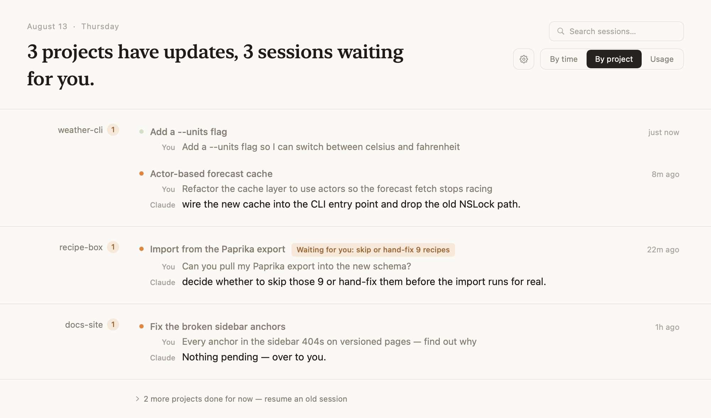
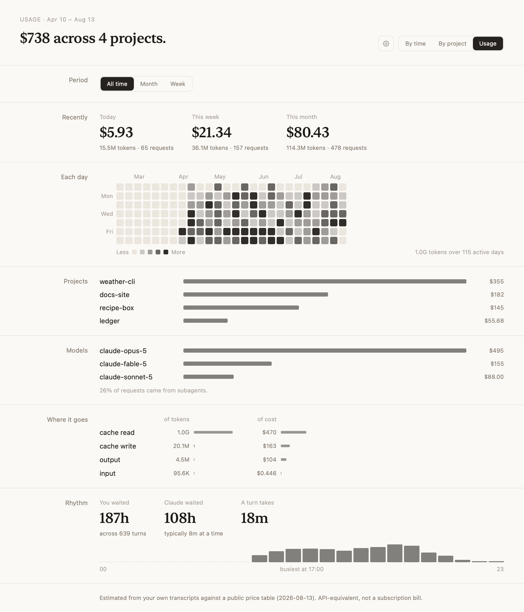
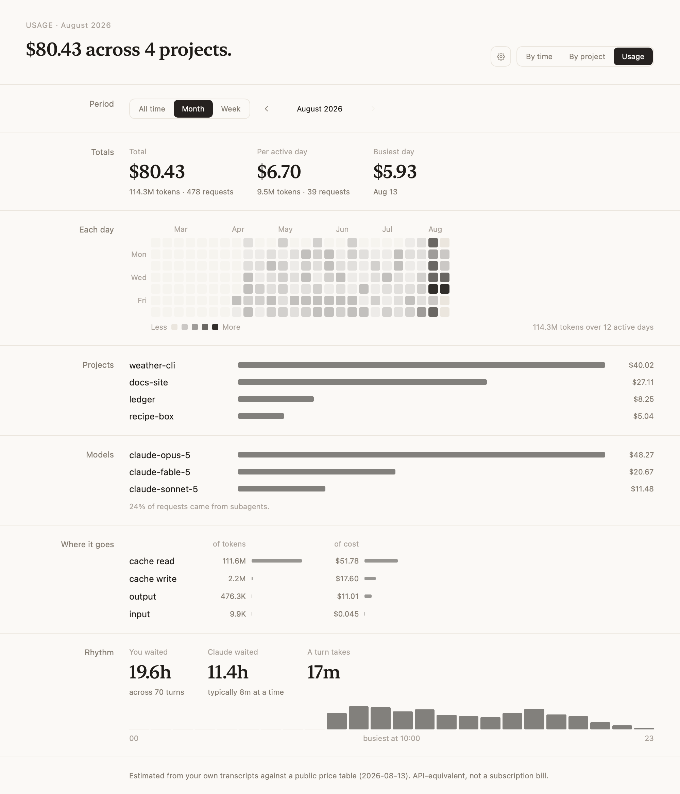

# Your Turn

**Claude Code 的收件匣，順便幫你記得 token 都燒到哪去了。**

當你同時開三個、五個、八個 Claude Code session，瓶頸就變成你自己。Your Turn 常駐在
macOS menu bar，回答四個問題：**我有哪些 session 開著？哪個在等我？它停在哪、下一步
是什麼？還有，我的 token 都燒在哪些專案上？**

它不跑 LLM、不讀對話內容，對 `~/.claude` 只讀不寫。

[English](README.md) | 繁體中文



## 現在輪到誰？

大多數 Claude Code menu bar 工具給你一顆狀態燈。Your Turn 追蹤的是更窄、也更有用的
一件事：**現在輪到誰**。正在跑的 session 不需要你；跑完的已經結束；唯一值得亮 badge
的，是停下來等你回覆的那個——而且你想知道的是**它最後說了什麼**，不只是一顆燈變黃。

每個 session 顯示三行：

1. **標題** — 認出這是哪個 session
2. **你** — 你最後要它做什麼
3. **Claude** — 它自己總結的「停在哪、下一步是什麼」

點下去，Your Turn 直接把你帶回 session 所在的位置：正確的 VS Code 視窗、正確的
iTerm2 分頁、正確的 Terminal 視窗。已結束的 session 則在新終端機用
`claude --resume` 接續。

## 這陣子到底在忙什麼？



用量分頁回答的是你自己回想不起來的事：**這週的時間到底被哪些專案吃掉、哪一個燒掉最多
token。** 選一個月或一週，整頁就跟著縮到那段期間——專案排名、模型拆分，以及你跟 Claude
各自等對方多久。

Claude Code 只把 token 數寫進對話紀錄，不寫金額，所以 Your Turn 對照
[LiteLLM 的公開價格表](https://github.com/BerriAI/litellm/blob/main/model_prices_and_context_window.json)
自己算。與 `ccusage` 交叉比對，總額誤差在 0.3% 以內。

### token 版的貢獻熱度圖



一格一天，深淺代表那天用 Claude 用得多兇。點任一格、或用箭頭前後翻，整頁就縮到那個月
或那一週。

## 功能

- **Menu bar badge 只算需要你的** — 正在跑的不打擾
- Menu bar 面板一列一個 session；要總覽時有完整視窗，支援搜尋、依時間／依專案分組
- **跳回原本的視窗** — 支援 VS Code、iTerm2、Terminal.app
- 重要的專案**標星**，不重要的**封存**
- **用量分頁** — 這週被哪些專案吃掉，依 token 與金額排名，附熱度圖與月／週 filter
- **開機啟動** — 設定頁一個開關，登記成 macOS 真正的登入項目
- **三套手調色票**（light / dim / dark）— 色票是資料，不是明暗開關
- **介面支援英文與繁體中文** — 預設跟隨系統語言，也可以在設定頁指定，整個 app 立刻換過去
- **零依賴** — 純 Swift 6 / SwiftUI，無第三方套件

## 隱私

Your Turn 是**閱讀器**。Claude Code 早就把需要的一切寫進 `~/.claude`，這個 app
只是去讀。

- 對 `~/.claude` **只讀不寫**
- 收件匣每個 session 檔只讀**尾端 64KB**。用量分頁會讀整份檔案，但只取 token 數字，
  一樣不看你和 Claude 說了什麼
- **無 telemetry、不跑 LLM** — 關於你的任何東西都不會離開這台 Mac
- **唯一一個對外請求，而且只在你打開用量分頁時發生**：對 LiteLLM 的公開價格表發一個
  GET，讓新上線的模型不會變成查無價。除了這個請求本身不送出任何東西，而且 app 內建
  一份精簡價格表，沒網路也能算
- 偏好設定（標星、封存、外觀）存在 UserDefaults / Application Support
- 開源，可自行稽核

唯一要求的權限是 Apple Events（把終端機切回 session 的視窗），macOS 會先詢問你。

## 安裝

**需求：** macOS 15+、[Claude Code](https://claude.com/claude-code)

- **下載**已簽章與公證的版本：[Releases](../../releases)，解壓縮拖進 Applications。
- **從原始碼建置：**

  ```bash
  git clone https://github.com/himynameisben/your-turn.git && cd your-turn
  ./Scripts/bundle.sh release
  open build/YourTurn.app
  ```

  app 留在 `build/`，圖示會出現在 menu bar。

  想直接裝進 `/Applications` 的話，`./Scripts/install.sh` 會做同一份建置，接著關掉
  正在跑的舊版、覆蓋掉 `/Applications/YourTurn.app`、再開起來。之後要更新就再跑同
  一行——平常用的那份建議走這條，因為「開機啟動」登記的是當時那個 bundle 路徑，從
  `build/` 打開的哪天目錄被清掉就失效了。

- Homebrew cask：規劃中。

## 運作原理

一切都來自 Claude Code 本來就維護在 `~/.claude` 的檔案：

| 路徑 | 提供什麼 |
|---|---|
| `projects/<slug>/<uuid>.jsonl` | session 標題、你的 last prompt、Claude 的 away summary、時間戳，以及每次請求的 token 數 |
| `projects/<slug>/<uuid>/subagents/*.jsonl` | 同上，但屬於這個 session 派出去的 subagent |
| `sessions/<pid>.json` | live 登記簿：哪個進程跑哪個 session、目前狀態 |
| `ide/<port>.lock` | session 屬於哪個 VS Code 視窗 |

有趣的工程決策（為什麼只讀尾端 64KB、為什麼 mtime 會說謊、live 進程怎麼配對 session、
以及為什麼同一個 `requestId` 在不同行會回報不同的 token 數）都帶著實測數字記錄在
[CLAUDE.md](CLAUDE.md) 與原始碼註解裡。

這一頁的截圖全部由 `YourTurn --render <dir> --demo` 用**虛構資料**產生，不是真實掃描。

## 參與開發

見 [CONTRIBUTING.md](CONTRIBUTING.md)。重點：維持閱讀器定位、維持零依賴、用內建的
`--dump` / `--cost` / `--render` 驗證改動。

## 授權

[MIT](LICENSE)
